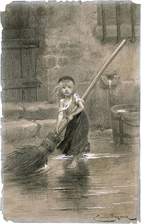

cosette — COnStruction et ExécuTion de TâchEs
=============================================

   Cosette, fille adoptive de Jean Valjean, illustrée par Émile Bayard (1862).

.. toctree::

   cosette/task
   cosette/depgraph
   cosette/scheduler
