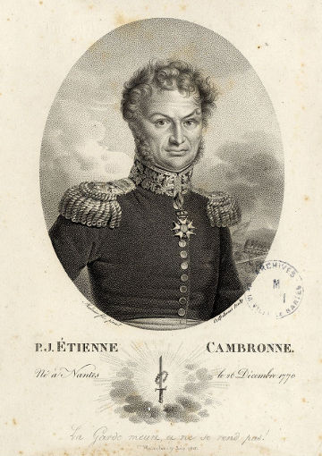

.. _cambronne-main:

cambronne — Commandes, Actions et MoBilisation Rapide des OpératioNs Exécutables
================================================================================

   Pierre Cambronne (1770-1842), général de Napoléon, dans une gravure de
   l'époque.

.. automodule:: valjean.cambronne
   :undoc-members:

.. toctree::
   :caption: Submodules

   cambronne/main
   cambronne/common

.. toctree::
   :caption: Subcommands
   :glob:

   cambronne/commands/*
