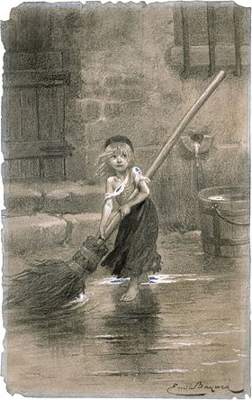

cosette — COnStruction et ExécuTion de TâchEs
=============================================

   Cosette, fille adoptive de Jean Valjean, illustrée par Émile Bayard (1862).

.. automodule:: valjean.cosette
   :undoc-members:

.. toctree::
   :caption: Submodules

   cosette/task
   cosette/rlist
   cosette/depgraph
   cosette/env
   cosette/scheduler
   cosette/code
