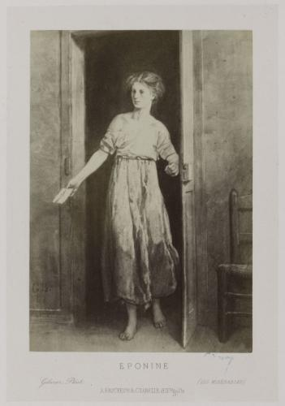

eponine — ExPloratiON et INtErfaçage
====================================

   Éponine, fille aînée des Thénardier, amoureuse de Marius, illustrée par Gustave Brion
   (2e édition ou première édition illustrée, entre 1862 et 1865 probablement)

.. automodule:: valjean.eponine
   :undoc-members:

.. toctree::
   :caption: Submodules

   eponine/base_dataset
   eponine/response_book
   eponine/tripoli4
