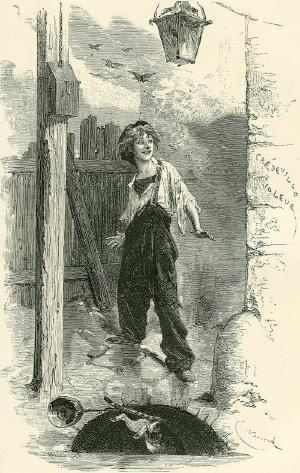

gavroche — Gestion AVancée de Routines et Oracles en CHaînE (nom temporaire)
============================================================================

   Gavroche Thénardier, illustré par Émile Bayard (1862).

.. automodule:: valjean.gavroche
   :undoc-members:

.. toctree::
   :caption: Submodules

   gavroche/harvest
   gavroche/test
   gavroche/dataset
   gavroche/stat_tests
   gavroche/eval_test_task
