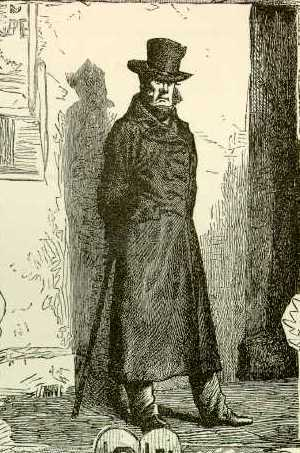

javert — Journal Automatique de VÉRificaTion
============================================

   L'inspecteur Javert, illustré par Émile Bayard (1862).

.. automodule:: valjean.javert
   :undoc-members:

.. toctree::
   :caption: Submodules

   javert/items
   javert/representation
   javert/table_elements
   javert/plot_elements
   javert/formatter
   javert/rst
   javert/mpl
