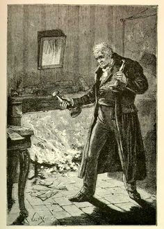

valjean — VALidation, Journal d'Évolution et ANalyse
====================================================

   Jean Valjean avec ses chandeliers, illustré par Émile Bayard (1862).

.. automodule:: valjean
   :undoc-members:

.. toctree::
   :caption: Submodules

   valjean/chrono
   valjean/config
   valjean/dyn_import
   valjean/path
